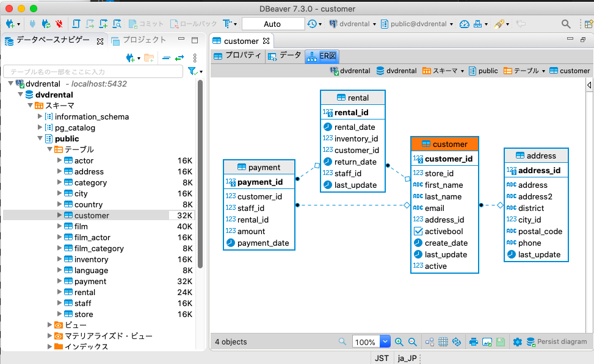

# Mac で postgresql + docker + schemaspy をする

Mac (not M!) に  postgresql と docker をインストールし, schemaspy で ER 図を作成するまでの手順を示します。

前提：  brew は install 済であること。  

全体の流れは次のようになります。  
　　1. postgresql のインストール、初期設定  
　　2. DBdaver のインストール  
　　3. docker のインストール  
　　4. schemasoy (on docker) で ER図をつくる  

- 参考情報

  - <https://www.bigbang.mydns.jp/postgresql-x.htm>
  PostgreSQLデータベース設定

  - <https://awesomecatsis.com/postgresql-mac-install/>
  PostgreSQLをhomebrewでインストールする方法

  - <https://tektektech.com/psql-mac-environm ent/ß>
  MacでPostgreSQLデータベースの環境をつくろう！

  - <https://qiita.com/sitilma/items/86609dc46e7e8835f7de>
  Docker入門 ~Hello World~
  
  - <https://densan-hoshigumi.com/server/postgresql-remote-connection>
  外部からデータベースへ接続するためのアクセス制御設定

  - <https://docs.docker.jp/engine/examples/postgresql_service.html>
  PostgreSQL の Docker 化

  - <https://dev.classmethod.jp/articles/schemaspy-docker-localize-jp/>
  SchemaSpyで日本語カラム名を含むデータベースからER図を作成

## 1. postgresql のインストール、初期設定

```shell-session
 $ brew install postgresql
```

DB の作り方や、postgres の起動方法等が表示されます。
この内容については brew info postgres を実行すれば再確認することができます。

```shell-session
$ brew info postgresql
postgresql: stable 13.1 (bottled), HEAD
  ... 省略 ...
To migrate existing data from a previous major version of PostgreSQL run:
  brew postgresql-upgrade-database

This formula has created a default database cluster with:
  initdb --locale=C -E UTF-8 /usr/local/var/postgres
For more details, read:
  https://www.postgresql.org/docs/13/app-initdb.html

To have launchd start postgresql now and restart at login:
  brew services start postgresql
Or, if you don't want/need a background service you can just run:
  pg_ctl -D /usr/local/var/postgres start
  ... 省略 ...
```

### DB 作成、ユーザー作成

DB を初期化します。
```shell-session
$ initdb /usr/local/var/postgres --encoding=UTF8 --no-locale
```

postgresql を起動して、DB 一覧を表示させてみます。
```shell-session
$ pg_ctl -D /usr/local/var/postgres start
$ psql -l
```

ユーザーを作成します。
```shell-session
$ createuser -s -P admin
Enter password for new role: 
Enter it again: 
```

作成したユーザーを消したいときは

```shell-session
$ dropuser admin
```

列名やデーア値に日本語を含む DB、table を作ってみます。

```shell-session
$ createdb sample01 admin
$ psql -l
```

spsql -l の出力に sample01 が含まれていることを確認してください。
sample01 を削除したい場合は、dropdb sample01 を実行してください。

sample01 にアクセスしてテーブル作成、レコード追加をしていきます。

```shell-session
$ psql -U admin sample01
psql (13.1)
Type "help" for help.

sample01=# \d
Did not find any relations.
sample01=# create table users (id integer, name varchar, 読み varchar);
CREATE TABLE
sample01=# \d
       List of relations
 Schema | Name  | Type  | Owner 
--------+-------+-------+-------
 public | users | table | admin
(1 row)

sample01=# select * from users;
 id | name | 読み 
----+------+------
(0 rows)

sample01=# INSERT INTO users values (1, '卑弥呼', 'ヒミコ');
INSERT 0 1
sample01=# select * from users;
 id |  name  |  読み  
----+--------+--------
  1 | 卑弥呼 | ヒミコ
(1 row)

sample01=# exit;
```

日本語の列名、値を使うことができています。

users テーブルを削除したければ drop table users; としてください。

## 2. DBdaver のインストール

DBの内奥を確認したり、編集するのに GUI のツールがあると便利です。
ここでは DBeaver を使っていきます。

```shell-session
$ brew install dbeaver-community
```

/Applications/DBeaver.app をダブルクリックして起動できます。
sample01 DB への接続を設定して、users を表示させると次のようになります。


DBeaver 上でも ER 図を表示させることはできます。ER 図をみるには、ER タブシートを開きます。


### もっと複雑なサンプルDB

postgresql のページにこんなサンプルDB があります。
<https://www.postgresqltutorial.com/postgresql-sample-database/> PostgreSQL Sample Database

これを DB に登録して DBeaver で閲覧してみます。

dbeaver.zip を download してきます。適当な作業フォルダを作成し、そこに dbeaver.zip を移動させます。  
その後、次のように操作します。

```shell-session
4 createdb --owner admin dvdrental
$ unzip dbrenatel.zip
$ tar zxvf drental.tar
# pg_restore -U admin --no-owner --role=admin -d dvdrental ./dvdrental.tar
```

data が登録されていることを確認してみます。


customer table に関する ER 図は次のようになります。(ERタブを表示させるだけです)


## 3. docker のインストール

DBeave で ER 図を得ることはできますが、schemaspy というツールで ER 図を作成してみます。

schemaspy は java 環境を整えてから、jar ファイルや DBアクセうドライバーをダウンロード後の、コマンドラインでツールを起動させることはできます。ここでは、docker をつかってローカル架橋上に java 環境を設定せずに schemaspy を使う方法を試していきます。

<https://www.docker.com/get-started> から docker.dmg を download してきて、インストールします。

```shell-session
$ docker --version
Docker version 20.10.0, build 7287ab3
```

```shell-session
$ docker run hello-world
Unable to find image 'hello-world:latest' locally
latest: Pulling from library/hello-world
0e03bdcc26d7: Pull complete 
Digest: sha256:1a523af650137b8accdaed439c17d684df61ee4d74feac151b5b337bd29e7eec
Status: Downloaded newer image for hello-world:latest

Hello from Docker!
  ... 省略 ...
```

```shell-session
$ docker ps -a
$ docker rm `docker ps -a -q` 
$ docker rmi hello-world
```

## 4. schemasoy (on docker) で ER図をつくる

docker 側からローカルマシン上の postgres にアクセスできるようにしておきます。
  1. ~/.pgpass の作成
  2. postgres の設定

### ~/.pgpass の作成

local マシンの IP アドレスをしらべておきます。
私の環境(mac) は 10.0.1.25 でした。

```shell-session
$ echo "10.0.1.25:5432:*:admin:admin" > ~/.pgpass
$ chmod 600 ~/.pgpass
```

psql -U admin dvdrental とした際に、 password を聞かれることなく、psql に入れるようになっていることを確認してください。

### postgres の設定

```shell-session
$ echo "host all  all    0.0.0.0/0  md5" >> /usr/local/var/postgres/pg_hba.conf
$ echo "listen_addresses='*'" >> /usr/local/var/postgres/postgresql.conf
```

IPアドレスを指定して psql に入れることを確認してください。
```shell-session
$ psql -h 10.0.1.25 -U admin dvdrental
```

ESET などアンチウイルスツールを使っている場合は、wirewoall で 5432 ポートへのアクセスを許可しておく必要もあります。

これで、外部(今の場合は docker) からローカルマシン上の postgresql にアクセスできるようになりました。
scheaspy ツールの docker で ER 図を作成してみます。

次のような内容で、./config/schemaspy.properties を作成します。

```shell-ession
$ cat config/schemapy.properties
schemaspy.t=pgsql
schemaspy.host=10.0.1.25
schemaspy.db=dvdrental
schemaspy.u=admin
schemaspy.p=admin
schemaspy.s=public

schemaspy.imageformat=svg
schemaspy.vizjs=true
```

ツールを実行します。
```shell-session
$ mkdir output
$ docker run -v "$PWD/output:/output" -v "$PWD/config/schemaspy.properties:/schemaspy.properties" schemaspy/schemaspy:latest
```

./output/index.html をブラウザでアクセスすると生成された ER 図を参照できます。

```script-session
$ open outut/index.html
```


### 日本語列名

store テーブルに "店名" という列を追加してみます。(DBeaver で作業すると簡単です)
前述の schemaspy の実行方法では、ER 図では、”店名" の部分は文字化けしてしまいます。


日本語フォントを含んだ docker イメージを作成し、ER図の作成を graphviz を使っておこなうようにすることで、文字化けを回避できます。
次の様に Dockerfile, run.sh, sample.sh, config/schemaspy.properties を作成します。

```script-session
$ cat Dockerfile
FROM schemaspy/schemaspy:latest
USER root
WORKDIR /
RUN apk update && \
    apk add --no-cache curl fontconfig && \
    mkdir download && \
    cd download && \
    curl -O https://moji.or.jp/wp-content/ipafont/IPAexfont/IPAexfont00401.zip && \    
    unzip IPAexfont00401.zip && \
    mkdir -p /usr/share/fonts/truetype/ipa && \
    cp */*ttf /usr/share/fonts/truetype/ipa && \
    fc-cache -fv && \
    rm -rf download
ENV LANG="ja_JP.UTF-8" \
    LANGUAGE="ja_JP:ja" \
    LC_ALL="ja_JP.UTF-8"
```

```script-session
$ cat run.sh
#!/bin/bash
rm -fr output/*
docker run -v "$PWD/output:/output" -v "$PWD/config/schemaspy.properties:/schemaspy.properties" schemaspy/\
japanese:ipaexg00401
```

```script-session
$ cat sample.sh
#!/bin/bash

# rm -fr download
# mkdir download
# cd download
# wget https://sp.postgresqltutorial.com/wp-content/uploads/2019/05/dvdrental.zip
# unzip dvdrental.zip
# 
# dropdb dvdrental
# createdb --owner admin dvdrental
# pg_restore -U admin --no-owner --role=admin -d dvdrental ./dvdrental.tar
# echo "ALTER TABLE store ADD 店名 varchar;" | psql -U admin dvdrental
# cd ..
# rm -fr download

rm -fr output
mkdir output

docker build -t schemaspy/japanese:ipaexg00401 .
./run.sh
open output/index.html
```

さらに config/schemaspy.properties の schemaspy.vizjs=true をコメントアウトしてください。

```script-sesion
$ cat cofig/schemaspy.properties
schemaspy.t=pgsql
schemaspy.host=10.0.1.25
schemaspy.db=dvdrental
schemaspy.u=admin
schemaspy.p=admin
schemaspy.s=public

schemaspy.imageformat=svg
# schemaspy.vizjs=true
```

sample.sh を実行して、store の ER 図を表示してみてください。
(sample.sh 中のコメントを外すと、dvdrental の DB 作成作業を dropdb, cratedb を含めすべて自動的で行うことができます。)


